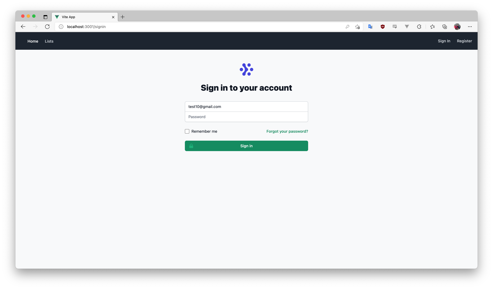
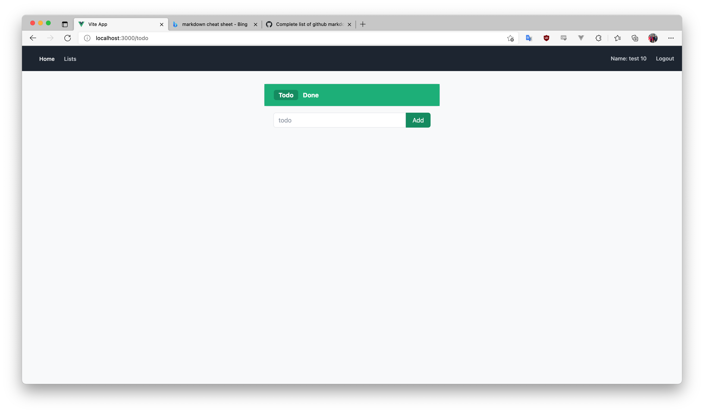

# firebase

inside /src/firebase.js, replace firebaseConfig with your own keys :smile:

## Screenshots




## Build Setup

```bash
# install dependencies
$ npm install

# serve with hot reload at localhost:3000
$ npm run dev

# build for production and launch server
$ npm run build

```

## Special Directories

You can create the following extra directories, some of which have special behaviors. Only `pages` is required; you can delete them if you don't want to use their functionality.

### `assets`

The assets directory contains your uncompiled assets such as Stylus or Sass files, images, or fonts.

### `components`

The components directory contains your Vue.js components. Components make up the different parts of your page and can be reused and imported into your pages, layouts and even other components.

### `router`

This directory contains your Vue Router routing files.

### `store`

This directory contains your Vuex store files. Creating a file in this directory automatically activates Vuex.

### `views`

This directory contains your application views and routes. Nuxt will read all the `*.vue` files inside this directory and setup Vue Router automatically.
